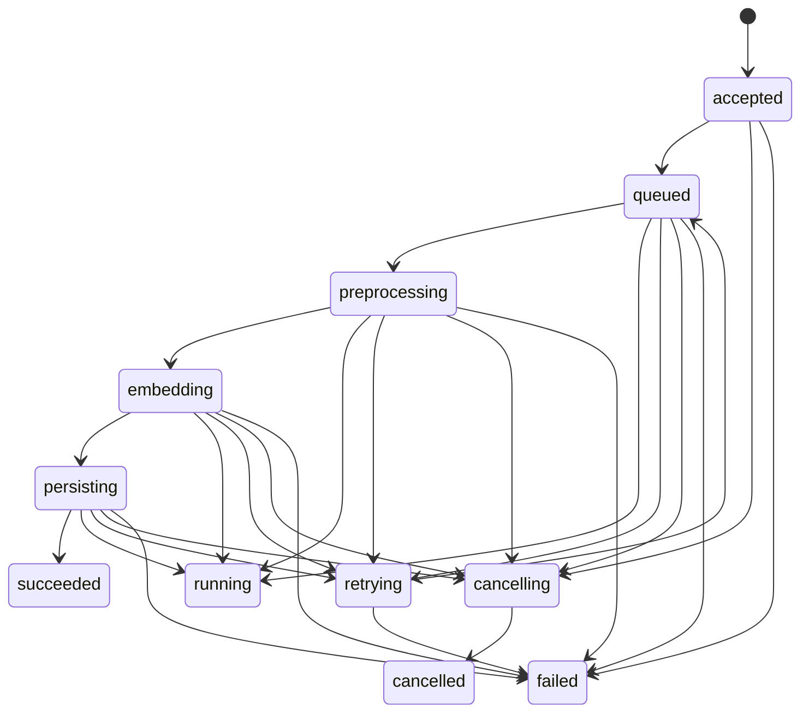

# 任务状态机设计

## 1. 目标

定义批量Embedding任务在平台中的标准生命周期，保证：

- 任务状态有清晰边界
- 各服务对状态理解一致
- 可支持重试、补偿、审计和恢复

本状态机优先服务于 `Phase 1` 的异步Embedding任务。

## 2. 任务对象

一个任务应至少包含以下核心字段：

- `task_id`
- `tenant_id`
- `task_type`
- `status`
- `model`
- `modality`
- `input_source`
- `progress`
- `created_at`
- `updated_at`
- `attempt_count`
- `error_code`
- `error_message`

## 3. 状态定义

### 非终态

| 状态 | 含义 |
|---|---|
| `accepted` | 请求已被平台接受，任务对象已创建 |
| `queued` | 任务已拆分并进入队列等待执行 |
| `preprocessing` | 正在做清洗、切块、去重等预处理 |
| `embedding` | 正在执行Embedding推理 |
| `persisting` | 正在写入向量库或结果存储 |
| `running` | 任务处于执行中汇总态 |
| `retrying` | 任务或分片处于重试中 |
| `cancelling` | 收到取消指令，正在终止 |

### 终态

| 状态 | 含义 |
|---|---|
| `succeeded` | 任务成功完成 |
| `failed` | 任务执行失败且不再重试 |
| `cancelled` | 任务被主动取消 |

## 4. 推荐简化视图

对外API可以暴露简化状态，减少调用方理解成本：

- `accepted`
- `queued`
- `running`
- `succeeded`
- `failed`
- `cancelled`

对内仍建议保留更细粒度状态以便排障和运营。

## 5. 状态流转



## 6. 流转规则

### 6.1 创建

- 客户端提交任务后，状态置为 `accepted`
- 任务元数据必须先持久化，后返回 `task_id`

### 6.2 排队

- 任务完成拆分并成功投递到队列后，置为 `queued`
- 若拆分失败或投递失败，可直接进入 `failed`

### 6.3 执行

- 分片开始预处理时，任务或分片进入 `preprocessing`
- 分片开始推理时，进入 `embedding`
- 分片开始向量落库时，进入 `persisting`
- 聚合视角下，对外可显示为 `running`

### 6.4 重试

- 可重试错误进入 `retrying`
- 达到最大重试次数后进入 `failed`
- 重试回到 `queued` 或具体执行阶段

### 6.5 取消

- 只有 `accepted`、`queued`、`running` 系列状态允许取消
- 已到 `succeeded`、`failed`、`cancelled` 的任务不得再次取消

## 7. 状态操作约束

| 操作 | 允许状态 | 结果状态 |
|---|---|---|
| `submit` | 无 | `accepted` |
| `enqueue` | `accepted` | `queued` |
| `start_preprocess` | `queued` | `preprocessing` |
| `start_embedding` | `preprocessing` / `queued` | `embedding` |
| `start_persist` | `embedding` | `persisting` |
| `mark_success` | `persisting` | `succeeded` |
| `mark_retry` | `queued` / `preprocessing` / `embedding` / `persisting` | `retrying` |
| `requeue` | `retrying` | `queued` |
| `mark_failed` | 非终态 | `failed` |
| `cancel` | 非终态 | `cancelling` -> `cancelled` |

若调用非法状态流转，建议返回：

- `TASK-STATE-409001`

## 8. 分片与聚合关系

建议区分：

- `task`：业务可见的总任务
- `task shard`：内部执行分片

规则：

- 总任务成功：所有必要分片成功
- 总任务失败：关键分片失败且不可恢复
- 总任务运行中：任一分片在执行中且整体未终态
- 总任务部分失败：MVP阶段可先映射为 `failed`，后续阶段再细化

## 9. 进度计算

MVP阶段建议简单按分片数量计算：

`progress = completed_shards / total_shards`

若需更精细，可按阶段加权：

- 预处理：20%
- 推理：50%
- 持久化：30%

## 10. 重试策略建议

- 仅对 `dependency_error`、`timeout_error` 等可恢复错误重试
- `validation_error`、`authorization_error` 不重试
- 重试建议采用指数退避
- 默认最大重试次数：3

## 11. 审计要求

每次状态变更必须记录：

- `task_id`
- `from_status`
- `to_status`
- `operator`
- `changed_at`
- `error_code`
- `reason`

## 12. 对外接口建议

`GET /v1/tasks/{taskId}` 返回：

```json
{
  "task_id": "task_123",
  "status": "running",
  "progress": 0.62,
  "created_at": "2026-04-03T11:00:00Z",
  "updated_at": "2026-04-03T11:10:00Z",
  "error_code": null,
  "error_message": null
}
```

## 13. MVP阶段最低要求

Phase 1 必须支持以下状态：

- `accepted`
- `queued`
- `running`
- `succeeded`
- `failed`

建议内部同时预留：

- `preprocessing`
- `embedding`
- `persisting`
- `retrying`

这样Phase 2补齐重试和治理能力时无需重做状态模型。

## 14. 当前骨架实现说明

当前仓库中的 MVP 骨架已采用：

- 请求创建任务后先进入 `queued`
- 后台 worker 从内存队列消费任务
- 可恢复错误先进入 `retrying`，再重新回到 `queued`
- 超过最大重试次数或不可恢复错误进入 `failed`

这使当前工程结构已经接近“真实队列消费”形态，后续替换成 Kafka 等正式中间件时，只需替换队列适配层。
