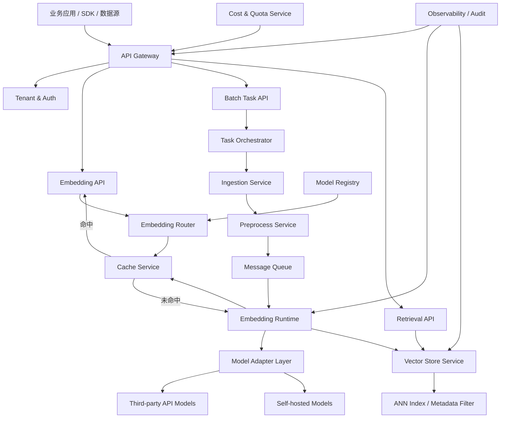

# Embedding平台架构设计

## 1. 设计目标

本平台以“标准化、高性能、低成本、可扩展”为核心，构建覆盖“数据输入-预处理-嵌入生成-向量存储-检索服务-监控运维”的全链路Embedding能力底座，服务检索、推荐、聚类、知识库、RAG、多模态理解等场景。

目标拆解如下：

- 统一化接入：通过标准化API屏蔽底层模型差异，支持多模型、多数据源、多模态统一接入。
- 高效能嵌入：支持同步低延迟与异步高吞吐两类模式，结合缓存、动态批处理、硬件加速，将单条文本嵌入延迟控制在50ms以内。
- 低成本可控：统一管理第三方API与自建模型，提供缓存、压缩、冷热分层、预算告警能力，整体成本降低30%以上。
- 高可用可靠：构建多活部署、故障隔离、失败重试、限流熔断、审计追踪机制，实现99.9%+平台可用性。
- 可扩展适配：支持模型热更新、维度适配、多租户、多部署形态与多模态扩展。
- 合规与安全：支持本地化部署、数据脱敏、传输与存储加密、权限控制、审计留痕，满足企业级场景要求。

## 2. 总体架构

平台采用“分层架构 + 微服务设计”，从下至上分为6层：

1. 基础设施层
2. 数据层
3. 核心引擎层
4. 服务层
5. 应用层
6. 运维监控层

### 2.1 分层说明

#### 2.1.1 基础设施层

提供平台运行所需的通用基础能力：

- 容器与编排：Kubernetes / KServe / Docker
- 计算资源：CPU、GPU、异构加速卡
- 消息队列：Kafka / Pulsar / RabbitMQ
- 服务治理：API Gateway、Service Mesh、配置中心、注册发现
- 存储底座：对象存储、块存储、本地SSD、高性能文件系统
- 网络与安全：VPC、WAF、TLS、KMS、IAM

#### 2.1.2 数据层

存放平台核心数据与元数据：

- 原始数据存储：文本、图片、音频、文档对象
- 元数据存储：任务状态、租户配置、模型配置、索引配置
- 向量存储：高维向量、索引结构、分区信息
- 缓存层：请求缓存、Embedding结果缓存、热点检索缓存
- 日志与审计数据：调用日志、操作日志、质量日志、成本日志

#### 2.1.3 核心引擎层

平台差异化能力集中在该层：

- 数据预处理引擎：清洗、去重、切片、格式标准化、脱敏
- Embedding路由引擎：基于租户、模态、成本、SLA、可用区做模型路由
- 推理执行引擎：同步推理、异步任务、动态批处理、GPU加速
- 向量索引引擎：建库、增量更新、压缩、分片、副本管理
- 召回与重排引擎：ANN召回、过滤、融合、重排
- 质量评估引擎：离线评测、在线A/B、漂移监控、召回效果分析

#### 2.1.4 服务层

面向业务输出标准化服务接口：

- Embedding API服务
- 批处理任务服务
- 检索服务
- 索引管理服务
- 模型管理服务
- 租户与权限服务
- 成本管理服务

#### 2.1.5 应用层

面向不同业务场景复用平台能力：

- RAG知识库
- 企业搜索
- 推荐与相似内容匹配
- 用户画像聚类
- 风控相似样本识别
- 多模态检索与理解

#### 2.1.6 运维监控层

对平台全链路进行可观测与运维治理：

- 指标监控：延迟、吞吐、错误率、GPU利用率、缓存命中率、召回质量
- 日志追踪：请求链路追踪、失败原因归档
- 告警体系：服务异常、模型异常、成本超预算、索引异常
- 审计体系：租户操作审计、模型变更审计、权限变更审计

## 3. 核心微服务拆分

建议按“控制面 + 数据面”拆分，降低耦合并提升扩展性。

### 3.1 控制面服务

#### 1. API Gateway

- 统一鉴权、限流、协议转换、版本控制
- 对外暴露REST/gRPC接口
- 支持租户级QPS控制与配额管理

#### 2. Tenant & Auth Service

- 管理租户、应用、密钥、角色、权限
- 支持RBAC/ABAC
- 支持细粒度资源授权

#### 3. Model Registry Service

- 管理模型版本、维度、模态、部署位置、计费方式
- 支持第三方API模型与本地模型统一注册
- 支持灰度发布、热切换、回滚

#### 4. Task Orchestrator

- 管理异步任务、批量任务、重试、幂等
- 协调预处理、推理、索引、缓存回写

#### 5. Index Management Service

- 管理向量库、分片、副本、索引参数、压缩策略
- 提供建库、重建、迁移、回滚能力

#### 6. Cost & Quota Service

- 汇总token、GPU时长、第三方API调用费用、存储成本
- 提供预算、配额、成本标签和告警

### 3.2 数据面服务

#### 1. Ingestion Service

- 接入文件、数据库、消息流、HTTP回调、对象存储
- 统一封装多数据源接入逻辑

#### 2. Preprocess Service

- 文本清洗、语言检测、切块、去重、图片标准化、音频转写
- 敏感信息脱敏与内容审查

#### 3. Embedding Runtime Service

- 执行Embedding推理
- 支持同步、异步、批量、动态批处理
- 支持多模型适配器模式

#### 4. Cache Service

- 请求级幂等缓存
- Embedding结果缓存
- 检索结果热点缓存

#### 5. Vector Store Service

- 向量写入、更新、删除、查询
- 管理ANN索引、元数据过滤、分区路由

#### 6. Retrieval Service

- 提供topK召回、条件过滤、混合检索
- 支持BM25 + Vector + Rerank融合

#### 7. Observability Agent

- 采集服务指标、模型推理指标、GPU指标、任务指标
- 输出监控与审计日志

## 4. 核心业务流程

平台遵循“请求先查缓存 -> 未命中则入队 -> 后台批量处理 -> 结果写回缓存”的核心流程。

### 4.1 同步Embedding请求流程

适用于低延迟接口调用场景。

1. 客户端调用`/v1/embeddings`
2. API Gateway完成鉴权、限流、租户识别
3. Embedding Router根据模态、租户策略、SLA、成本策略选择目标模型
4. Cache Service根据`tenant + model + normalized_input_hash`查询缓存
5. 若命中则直接返回结果
6. 若未命中，则进入Embedding Runtime
7. Runtime执行轻量预处理并参与动态批处理
8. 推理结果返回后写入缓存与日志系统
9. 客户端获得向量结果

### 4.2 异步批量Embedding流程

适用于离线入库、大规模知识库构建场景。

1. 客户端提交批处理任务
2. Task Orchestrator生成任务并拆分分片
3. Ingestion读取原始数据，Preprocess执行清洗、切块、去重
4. 结果写入消息队列
5. Embedding Runtime批量消费并进行动态批处理
6. 向量结果写入Vector Store
7. 任务状态回写Metadata DB，并回调业务方

### 4.3 检索流程

1. 用户输入查询
2. 查询文本进入Embedding API生成查询向量
3. Retrieval Service调用Vector Store做ANN召回
4. 按租户、标签、时间范围进行元数据过滤
5. 可选执行Rerank或混合检索融合
6. 返回topK结果与相似度分数

## 5. 核心架构图



## 6. 标准化接口设计

建议统一OpenAPI风格接口，并保留gRPC高性能通道。

### 6.1 Embedding接口

`POST /v1/embeddings`

请求示例：

```json
{
  "tenant_id": "tenant-a",
  "model": "bge-m3",
  "modality": "text",
  "input": [
    "什么是向量数据库？",
    "Embedding平台设计目标"
  ],
  "encoding_format": "float",
  "dimension": 1024,
  "metadata": {
    "scene": "rag"
  }
}
```

返回示例：

```json
{
  "request_id": "req_123",
  "model": "bge-m3",
  "dimension": 1024,
  "data": [
    {
      "index": 0,
      "embedding": [0.123, -0.056]
    },
    {
      "index": 1,
      "embedding": [0.087, 0.221]
    }
  ],
  "usage": {
    "input_tokens": 32,
    "cache_hit": false
  }
}
```

### 6.2 批任务接口

- `POST /v1/tasks/embedding`
- `GET /v1/tasks/{task_id}`
- `POST /v1/tasks/{task_id}/cancel`

### 6.3 索引管理接口

- `POST /v1/indexes`
- `POST /v1/indexes/{index_id}/rebuild`
- `POST /v1/indexes/{index_id}/compact`
- `DELETE /v1/indexes/{index_id}`

### 6.4 检索接口

- `POST /v1/retrieval/search`
- `POST /v1/retrieval/hybrid-search`

## 7. 模型适配与路由策略

平台需支持统一模型抽象，屏蔽底层调用差异。

### 7.1 模型抽象字段

- `model_id`
- `provider_type`
- `modality`
- `dimension`
- `max_input_length`
- `latency_sla`
- `cost_per_1k`
- `deploy_mode`
- `region`
- `status`

### 7.2 路由决策因素

- 模态：文本、图像、音频
- 场景：检索、聚类、推荐、RAG
- 成本：优先第三方API或优先自建模型
- 延迟：同步请求优先低延迟模型
- 租户等级：高等级租户使用专属模型池
- 可用性：故障时自动切换备选模型

### 7.3 适配器模式

建议通过`Model Adapter`封装不同供应商协议：

- `OpenAICompatibleAdapter`
- `LocalHFAdapter`
- `MultimodalVisionAdapter`
- `AudioEmbeddingAdapter`

这样可保证接口统一，同时方便快速集成新模型。

## 8. 性能设计

### 8.1 低延迟设计

- 使用Redis缓存热点Embedding结果
- 对短文本请求启用同步推理直通
- 采用gRPC和连接池减少网络开销
- 模型服务预热，避免冷启动
- 对常用模型维持常驻副本

### 8.2 高吞吐设计

- 动态批处理：在10ms~20ms窗口内合并请求
- 微批次推理：根据token数和显存动态调节batch size
- 异步任务队列：削峰填谷
- 分片并行：大批任务拆分为可并发子任务
- GPU亲和调度：减少模型切换开销

### 8.3 长上下文与大文件处理

- 切块策略支持固定窗口、语义切块、层级切块
- 切块过程保留父文档ID、段落偏移、版本号
- 超大文件先离线预处理，再进入批量Embedding流程
- 对异常切块与超长输入进行旁路审计

## 9. 数据与存储设计

### 9.1 数据分层

- 热数据：近期频繁检索向量，放高性能向量库和Redis
- 温数据：中期业务数据，保留完整索引
- 冷数据：历史向量与原始文档，归档至对象存储

### 9.2 向量存储建议

可根据场景选择不同类型引擎：

- 高吞吐检索：Milvus / Qdrant / Weaviate
- 轻量一体化：pgvector
- 搜索融合：Elasticsearch / OpenSearch + dense vector

### 9.3 压缩与降本

- 向量量化：PQ / OPQ / Scalar Quantization
- 索引压缩：HNSW参数调优、倒排分层
- 重复内容去重，避免重复Embedding
- 按租户/业务线配置存储级别

## 10. 高可用与容灾设计

### 10.1 可用性设计

- API Gateway多副本部署
- Runtime服务按模型池隔离，避免相互影响
- 向量库分片 + 副本机制
- 消息队列持久化与消费确认
- 缓存失效不影响主流程，只影响性能

### 10.2 容错与降级

- 第三方API失败自动回退本地模型
- GPU资源不足时切换CPU降级模型
- 检索服务异常时支持返回缓存结果或近线索引结果
- 对异步任务失败执行指数退避重试

### 10.3 多活与灾备

- 关键服务跨可用区部署
- 元数据数据库主从或多副本
- 向量索引定期快照与异地备份
- 模型仓库与配置中心跨区同步

## 11. 安全与合规设计

### 11.1 数据安全

- 全链路TLS加密
- 存储侧AES-256加密
- 敏感字段脱敏、哈希化或Token化
- 对敏感租户支持专属VPC和本地化部署

### 11.2 权限控制

- 租户隔离
- 应用级API Key
- 角色权限控制
- 资源粒度审计

### 11.3 审计与合规

- 记录谁在何时访问了什么模型和数据
- 保留模型变更、权限变更、索引变更日志
- 支持数据保留策略与自动清理策略
- 满足金融、医疗等高敏感场景的本地化合规要求

## 12. 监控与运维体系

### 12.1 关键指标

- 接口延迟：P50 / P95 / P99
- 吞吐：QPS、批量任务处理速率
- 稳定性：错误率、超时率、重试率
- 资源：CPU、GPU、显存、内存、磁盘、网络
- 质量：召回率、NDCG、重复向量率、漂移指标
- 成本：单租户成本、单模型成本、每千次请求成本

### 12.2 告警策略

- P99延迟超过阈值
- 缓存命中率显著下降
- 模型推理错误率升高
- 索引构建失败
- 第三方API费用异常增长
- GPU利用率过高或长时间过低

### 12.3 运维能力

- 模型灰度发布
- 一键扩缩容
- 索引滚动重建
- 异常任务重放
- 配置热更新

## 13. 成本控制方案

### 13.1 计算成本优化

- 高频请求优先走缓存
- 长尾请求按SLA路由低成本模型
- 混合部署第三方API + 本地模型
- 非实时任务集中在低峰时段执行

### 13.2 存储成本优化

- 热温冷分层
- 向量压缩
- 冗余副本按业务等级控制
- 历史低频索引归档

### 13.3 管理手段

- 成本仪表盘
- 预算告警
- 模型成本对比报表
- 租户配额与限额

## 14. 推荐技术选型

以下为建议组合，可按团队现状裁剪：

### 14.1 接口与服务治理

- API框架：FastAPI / Go Fiber / Spring Boot
- 高性能RPC：gRPC
- 网关：Kong / APISIX / Envoy
- 配置中心：Nacos / Consul

### 14.2 任务与缓存

- 消息队列：Kafka
- 缓存：Redis
- 工作流编排：Temporal / Argo Workflows

### 14.3 模型推理

- 模型服务：vLLM / Triton Inference Server / TGI
- 本地模型管理：Hugging Face + 自建模型仓库
- GPU调度：Kubernetes + NVIDIA Operator

### 14.4 数据与向量库

- 元数据库：PostgreSQL
- 对象存储：MinIO / S3
- 向量数据库：Milvus / Qdrant
- 混合检索：OpenSearch

### 14.5 可观测性

- 指标：Prometheus
- 日志：Loki / ELK
- 链路追踪：Jaeger / Tempo
- 仪表盘：Grafana

## 15. 部署模式建议

### 模式A：云原生共享平台

适合多数企业内部通用AI底座：

- 多租户共享控制面
- 模型按池化方式部署
- 向量库按租户逻辑隔离

### 模式B：专有化私有部署

适合金融、医疗、政企：

- 控制面和数据面均部署在内网
- 敏感数据不出域
- 第三方API默认禁用或仅白名单开放

### 模式C：边缘轻量部署

适合弱网、现场终端场景：

- 轻量模型 + 小型向量库
- 本地缓存与离线同步
- 周期性与中心平台做索引汇聚

## 16. 分阶段实施路线图

### Phase 1：MVP

目标：快速可用，完成基础文本Embedding与检索闭环。

- 提供统一Embedding API
- 接入2~3个文本模型
- 支持Redis缓存、批量任务、Milvus/Qdrant向量存储
- 建立基本监控和日志体系

### Phase 2：生产化

目标：满足业务正式接入与成本治理要求。

- 增加租户、权限、配额、审计
- 引入动态批处理、成本仪表盘、自动扩缩容
- 支持混合检索与索引生命周期管理
- 实现多AZ高可用部署

### Phase 3：平台化

目标：成为统一AI检索与Embedding底座。

- 支持图像、音频多模态Embedding
- 支持模型灰度发布、A/B测试、质量评测
- 建立模型市场、场景模板、SDK体系
- 支持云、私有化、边缘一体化部署

## 17. 关键SLO建议

- 同步文本Embedding P95延迟：< 50ms
- 批量任务吞吐：较单条模式提升10~100倍
- 平台月可用性：>= 99.9%
- 长上下文处理错误率：< 1%
- 检索服务P95延迟：< 100ms
- 高优租户缓存命中率：> 70%

## 18. 总结

该Embedding平台本质上不是“单一模型服务”，而是一个围绕向量生产、管理、检索、治理和运维的企业级基础平台。其关键设计点在于：

- 用标准化接口统一多模型与多模态
- 用缓存、队列、动态批处理实现高性能与低成本
- 用控制面与数据面分离支撑平台化扩展
- 用多活、审计、权限、合规能力满足生产环境要求

若后续进入实施阶段，建议优先建设“MVP最小闭环”：统一Embedding API + 批处理任务 + 向量库 + 缓存 + 基础监控，再逐步补齐多模态、成本治理、模型热更新与平台运营能力。
